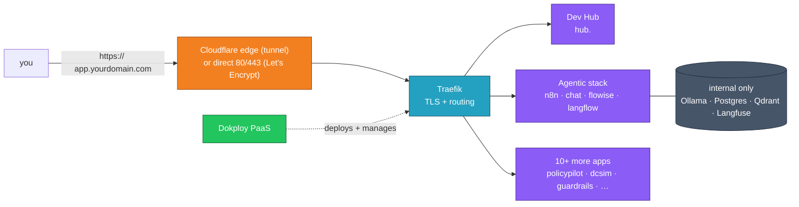
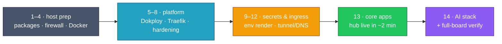

<div align="center">

# Ubuntu Dokploy AI

**One command turns a fresh Ubuntu server into the full Check Point AI & agentic demo stack** —
[Dokploy](https://dokploy.com) PaaS · Traefik TLS · **~15 apps**, hardened, deployed & verified for you.

<a href="https://github.com/alshawwaf/dev-hub"></a>


<sub>


</sub>

</div>

```bash
curl -fsSL https://raw.githubusercontent.com/alshawwaf/ubuntu-dokploy-ai/main/install.sh \
  | sudo bash -s -- --domain yourdomain.com
```

> [!NOTE]
> **You bring Ubuntu and a domain — that's the entire prerequisite list.** The script installs Docker and Dokploy, generates every secret, sets up ingress (Let's Encrypt **or** Cloudflare Tunnel), deploys the suite, and verifies every app actually serves before saying "done". Runs are **idempotent** and **self-updating**, images are **prebuilt on GHCR** (the box pulls, it never compiles), and the run **survives SSH drops**.



**Contents:**
[What you get](#what-you-get) ·
[Quick start](#quick-start) ·
[Prerequisites](#prerequisites) ·
[How it works](#how-installsh-works) ·
[Live dashboard](#the-live-dashboard) ·
[Configuration](#configuration) ·
[Access](#accessing-your-stack) ·
[Uninstall](#uninstall) ·
[Security](#security) ·
[Reference](#reference) ·
[Repository layout](#repository-layout) ·
[Troubleshooting](#operations--troubleshooting)

---

## What you get

Every app is published at its own `https://<app>.<DOMAIN>` subdomain via Traefik. The catalog, domains, and ports live in [`automation/dokploy_config.json`](automation/dokploy_config.json) — that file is the source of truth; this table is a snapshot.

| App | URL | What it is |
|---|---|---|
| **Dev Hub** | `hub.<DOMAIN>` | macOS-desktop-style portal that ties the suite together and embeds each app in a window |
| **CP Agentic MCP Playground** | `n8n.` · `chat.` · `flowise.` · `langflow.<DOMAIN>` | Build AI agents (n8n, Open WebUI, Flowise, Langflow) over Check Point MCP servers — Langfuse tracing at `trace.<DOMAIN>` |
| **PolicyPilot** | `policypilot.<DOMAIN>` | Turn plain-language / ticket requests into safe Check Point access-policy changes |
| **Drawbridge** | `dcsim.<DOMAIN>` | Datacenter Simulator serving Check Point / CloudGuard-format datacenter feeds for PoV demos |
| **AI Guardrails Playground** | `guardrails.<DOMAIN>` | Test LLM prompt-injection / jailbreak guardrails across providers |
| **AI-Infra-Guard** | `aig.<DOMAIN>` | AI red-teaming: MCP security scanning + jailbreak evaluation |
| **Threat Prevention Server** | `threat.<DOMAIN>` | Check Point threat-prevention demo / data server |
| **Training Portal** | `training.<DOMAIN>` | Hands-on lab portal (Apache Guacamole remote access) |
| **AI Basic Training** | `learn.<DOMAIN>` | Introductory AI / security training portal |
| **Docs to Swagger** | `swagger.<DOMAIN>` | Convert Check Point API docs into browsable OpenAPI / Swagger |
| **Identity Provider (IdP)** | `idp.<DOMAIN>` | SAML / SCIM Identity Provider simulator for SSO demos |
| **OpenClaw** | `claw.<DOMAIN>` | Third-party agentic browser, embedded in the hub |
| **Script Builder** | `scriptbuilder.<DOMAIN>` | Check Point script builder (private repo — see [Private repositories](#private-repositories-script-builder)) |
| Ollama · PostgreSQL · Qdrant · Langfuse | *internal* | Backends for the agentic stack — never exposed to the internet |

> [!TIP]
> **Preconfigured agents, ready on first login.** The agentic app auto-imports ready-to-run n8n workflows on deploy: a Docker MCP Gateway fronting every Check Point MCP server (a direct-connection agent and a `*-via-gateway` twin for each), plus PolicyPilot and Dev Hub agents — bearer tokens and `<DOMAIN>` substituted at import time. For the wider story — audience, architecture, the MCP fleet — read [docs/PLATFORM_OVERVIEW.md](docs/PLATFORM_OVERVIEW.md).

---

## Quick start

Two ingress modes — pick the one that matches your host:

| Mode | Use when | How apps get TLS |
|---|---|---|
| `letsencrypt` *(default)* | The host has **public inbound** `80`/`443` (VPS, cloud VM) | Traefik issues Let's Encrypt certs via HTTP-01; a wildcard DNS `A` record points at the host |
| `tunnel` | The host has **no public inbound** (home server, NAT, CGNAT) | A Cloudflare Tunnel dials out to Cloudflare's edge; edge TLS is free — no port-forwarding, no public `A` record |

### Public host — Let's Encrypt (default)

Add the wildcard `A` record (see [Prerequisites](#prerequisites)), then on the box:

```bash
curl -fsSL https://raw.githubusercontent.com/alshawwaf/ubuntu-dokploy-ai/main/install.sh \
  | sudo bash -s -- --domain yourdomain.com
```

### Private / NAT host — Cloudflare Tunnel

Put your Cloudflare credentials in an answers file first (see [Configuration](#configuration)), then:

```bash
curl -fsSL https://raw.githubusercontent.com/alshawwaf/ubuntu-dokploy-ai/main/install.sh \
  | sudo bash -s -- --domain yourdomain.com --ingress tunnel --answers /path/to/answers.env
```

To prepare the answers file:

```bash
git clone https://github.com/alshawwaf/ubuntu-dokploy-ai.git && cd ubuntu-dokploy-ai
cp answers.env.example answers.env
# edit answers.env: DOMAIN, CLOUDFLARE_API_TOKEN, CLOUDFLARE_ACCOUNT_ID + any BYO API keys
sudo ./install.sh --domain yourdomain.com --ingress tunnel --answers answers.env
```

### The wipe → redeploy cycle

The two commands for a repeatable lab — terminate **keeping the image cache and LLM weights**, then reapply:

```bash
# terminate (fast-cycle form)
curl -fsSL https://raw.githubusercontent.com/alshawwaf/ubuntu-dokploy-ai/main/install.sh \
  | sudo bash -s -- --uninstall --yes --keep-images --keep-models --answers /path/to/answers.env

# reapply
curl -fsSL https://raw.githubusercontent.com/alshawwaf/ubuntu-dokploy-ai/main/install.sh \
  | sudo bash -s -- --domain yourdomain.com --ingress tunnel --answers /path/to/answers.env
```

> [!TIP]
> **Timing:** fresh Ubuntu ≈ **15–20 min** (bandwidth-bound image pulls) · wipe→redeploy with the keep flags ≈ **6–10 min**. For a wipe back to **bare Ubuntu**, swap the keep flags for `--remove-docker --purge-secrets`.

**Good to know**

- **Idempotent** — generated secrets persist and are reused, installs are guarded, firewall rules re-apply cleanly. Re-running redeploys the apps.
- **Self-updating** — piped runs refresh their on-disk clone (`/opt/ubuntu-dokploy-ai`) from `main` at startup; every run uses the latest installer.
- **Everything is logged** — the live panel shows the tail; the full raw output of every command lands in `/var/log/dokploy-ai-install.log`.
- **No `curl`?** `wget -qO- https://raw.githubusercontent.com/alshawwaf/ubuntu-dokploy-ai/main/install.sh | sudo bash -s -- --domain yourdomain.com`

---

## Prerequisites

**Both modes:** Ubuntu 22.04 / 24.04 LTS with root, and a domain you control. You do **not** install Docker or anything else first — the script handles the engine, OS/Python packages, Dokploy, and every dependency. Already manage Docker yourself? Add `--skip-docker`.

### Let's Encrypt mode

- A **public IP** with inbound `80`/`443` reachable from the internet.
- A **wildcard DNS `A` record** pointing at the host — the one manual step:

  ```text
  Type: A    Name: *    Value: <SERVER_IP>    TTL: 3600
  ```

> [!IMPORTANT]
> The installer **verifies** the wildcard record and prints exactly what to add if it's missing — but it does not create it. Traefik needs it to issue certificates for every `*.yourdomain.com` subdomain.

### Cloudflare Tunnel mode

For a home server or any NAT'd/CGNAT box with no reachable inbound ports. Full walkthrough: [docs/tunnel-ingress.md](docs/tunnel-ingress.md). In brief:

- The **domain hosted on Cloudflare** (nameservers on Cloudflare; the free plan is fine).
- A **Cloudflare API token** ([create one](https://dash.cloudflare.com/profile/api-tokens)) with scopes `Account > Cloudflare Tunnel > Edit`, `Zone > DNS > Edit`, `Zone > Zone > Read`, plus your **account id** — both go in `answers.env`.
- **No port-forwarding and no `A` record** — the installer creates a proxied wildcard `CNAME` and runs `cloudflared` as a systemd service.

> [!WARNING]
> **Cert depth on the free plan:** Cloudflare's free Universal SSL covers the zone apex and **one** wildcard level (`yourdomain.com` + `*.yourdomain.com`). Pass the **zone apex** as `--domain`. A subdomain like `--domain ai.yourdomain.com` puts apps two levels deep, where the free cert does **not** reach — the installer warns you and names the zone to use.

### Private repositories (Script Builder)

Most apps clone from public HTTPS repos. **Script Builder** clones over SSH from a private repo, so it is **skipped by default** (a clear message, not a failure); every other app still deploys. To include it: print the box's key with `sudo cat /root/.ssh/id_rsa.pub`, add it on GitHub as a **read-only deploy key** (repo → Settings → Deploy keys), then re-run with `ALLOW_SSH_REPOS=1`.

---

## How `install.sh` works



A fixed **14-step pipeline**, each step a row on the [live dashboard](#the-live-dashboard):

| # | Step | What happens |
|---|---|---|
| 1 | **Preflight** | Piped runs (`curl \| bash`) first **materialize the repo on disk and re-exec from the file** — a dropped SSH session can never cut off the script's source mid-run. Then root/OS checks and domain/ingress resolution. |
| 2 | **Base packages** | Apt packages only (`python3-requests`, `python3-paramiko`, `python3-yaml`, `git`, `ufw`, `fail2ban`, `unattended-upgrades`) — no PyPI/pip. Detects the public IP and WAN interface. |
| 3 | **Base firewall** | `ufw` default-deny; allow `22/80/443` (only `22` in tunnel mode — the tunnel dials out). |
| 4 | **Docker engine** | Installed if absent, then Docker's address pools are **pinned to `10.201/10.202.0.0/16`** — the stock pools spill into `192.168.0.0/16` after ~16 networks and can black-hole SSH on a `192.168.x` management LAN. |
| 5 | **Dokploy platform** | Installed if absent. Resumed installs also verify the **`dokploy-traefik` container** exists and create it if not — without it every app deploys but nothing listens on 80/443. |
| 6 | **Traefik hubframe middleware** | Strips `X-Frame-Options` / sets a permissive `frame-ancestors` CSP as a default middleware, so every app can embed in the Dev Hub desktop. |
| 7 | **Host hardening** | `DOCKER-USER` iptables chain (all app ports forced through Traefik), `fail2ban`, unattended upgrades, root key-only sshd, an `authorized_keys` audit — and on **vmxnet3** vNICs, NIC offloads are disabled (persisted) to stop corrupted-stream SSH drops under load. |
| 8 | **Loopback SSH key** | Generated + self-authorized so Dokploy manages the box over `127.0.0.1` with no external exposure. |
| 9 | **Secrets & env rendering** | [`bootstrap_secrets.py`](automation/bootstrap_secrets.py) generates strong secrets into `/etc/dokploy-ai/secrets.env` (0600, reused every run) and renders every app `.env` from [`automation/envs/`](automation/envs/). |
| 10 | **Cloudflare Tunnel ingress** | *(tunnel mode)* [`setup_tunnel.py`](automation/setup_tunnel.py) provisions `cloudflared`, the named tunnel, the proxied wildcard `CNAME`, and the systemd service; gates the Dokploy dashboard behind basic auth at `dokploy.<DOMAIN>`. |
| 11 | **Agentic playground fetch** | Fetches [cp-agentic-mcp-playground](https://github.com/alshawwaf/cp-agentic-mcp-playground) to `/opt/cp-agentic-mcp-playground` — updated in place on re-runs, never re-cloned. |
| 12 | **DNS pre-check** | *(letsencrypt mode)* [`dns_precheck.py`](automation/dns_precheck.py) confirms the wildcard + every subdomain resolve; aborts with the exact record to add if not. |
| 13 | **Core apps — hub + essentials** | [`dokploy_automate.py`](automation/dokploy_automate.py) registers the Dokploy admin and **triggers** the hub + lightweight apps. Dokploy deploys in submission order — **`https://hub.<DOMAIN>` is reachable in a couple of minutes**. |
| 14 | **AI stack — models + agentic bundle** | Queues the heavy tier right behind core (`--tier heavy --no-purge` — it *adds*, never clean-slates), then **one verification pass over the whole board**: every app must have running containers *and* actually serve. |

### Why installs are fast — prebuilt images

Every first-party app image is **prebuilt and published to GHCR** by its own repo's `publish-image.yml` workflow (buildx, `:latest` + `:sha`, public packages). The deploy composes *pull* (`pull_policy: always`) instead of compiling from source — which used to dominate install time with multi-GB on-box builds. The old `build:` blocks stay commented in each compose for local development.

> [!NOTE]
> **LLM model weights are fire-and-forget.** The download is triggered during the deploy and continues in the background after "Provisioning complete" — chat/agent apps are up immediately and answer prompts once their model lands. Watch with `docker logs -f ollama-pull-models-cpu`; a model shows in `ollama list` when ready. Uninstalling with `--keep-models` makes the next pull a no-op.

---

## The live dashboard

```text
  ◆ ubuntu-dokploy-ai · one-command provisioner            [ INSTALL · tunnel ]
  yourdomain.com · host · Ubuntu 24.04    ◷ 03:15   ▣ 7/11 apps
  overall  ▕██████████████████████████░░▏ 92%  ✓ 13/14
  apps     ▕██████████████████░░░░░░░░░░▏ 63%  ▣ 7/11

  ✔ hub is live → https://hub.yourdomain.com
  ─ deploying apps ────────────────────────────────────────────
  ✔ Dev Hub                 3/3        ✔ PolicyPilot        1/1
  ✔ Training Portal         6/6        ⠦ CP Agentic MCP    28/36
  ✔ Drawbridge              1/1        ○ OpenClaw           0/0

  ╭─ AI stack — models + agentic bundle · live output ────────╮
  │ pulling ghcr.io/…/cp-agentic-n8n:latest                    │
  │ overall progress: 9 out of 11 tasks                        │
  ╰─ full log → /var/log/dokploy-ai-install.log · d hides ─────╯
```

The installer picks a renderer automatically — a **rich dashboard** on interactive terminals (painted on the *alternate screen*, so your shell and scrollback stay untouched), or **plain numbered-step lines** when piped / under `nohup` (`--plain` / `NO_RICH_UI=1` to force).

The rich dashboard:

- **Sizes itself to your real window — even through sudo's pty** — and centers horizontally + vertically. `--big` renders double-width (2×) text.
- The **14-step checklist** — animated spinner on the running step; `✔` done / `▲` warned / `⤼` skipped / `○` pending, each with its duration.
- A **contained live-output box** titled with the running step: output tail-follows *inside* the frame (the screen never scrolls), progress-style lines (docker layers, apt, `overall progress: N/M`) **update in place**, and **pressing `d`** collapses/expands the box.
- **Two labeled progress bars** during the deploy waves — `overall` tracks the 14-step plan, `apps` tracks the board.
- The **live app board** — `○` queued · `⠦` building · `✔` up · `▲` degraded · `✖` failed, with container counts, flipping to `✔ hub is live` the moment the hub answers.

And its guarantees:

- **The final view holds until you press a key — success, failure, and uninstall alike.** A green `✔ provisioning complete` / `✔ uninstall complete` chip (or a red `✖ FAILED` banner naming the step) stays anchored under the frame until you dismiss it; then the run-summary table prints to your scrollback. Headless/CI runs never block (`HOLD=0`, `UI_HOLD_TIMEOUT` default 600s).
- **Nothing can print below the dashboard** — while the frame is up, all command output diverts into the run log; stray output can't scroll or flash the screen.
- **A dropped SSH session cannot kill the run** — the installer demotes itself to headless and finishes the deploy. Re-attach with `sudo tail -f /var/log/dokploy-ai-install.log`; run inside `tmux` if you want the dashboard itself to be reconnectable.
- **Verification is real** — [`verify_deployment.py`](automation/utils/verify_deployment.py) polls Dokploy's deploy status *and* the actual containers *and* probes each app's hosts through Traefik; an app counts as up only when it serves.

---

## Configuration

### `answers.env`

Copy [`answers.env.example`](answers.env.example) → `answers.env` (git-ignored). **Only `DOMAIN` is required**; everything else is optional — any bring-your-own key you omit is reported at the end and simply leaves that one integration disabled. The essentials:

| Key | When | Purpose |
|---|---|---|
| `DOMAIN` | **required** | Root domain the apps hang off |
| `CLOUDFLARE_API_TOKEN` / `CLOUDFLARE_ACCOUNT_ID` | tunnel mode | Cloudflare API token + account id |
| `AZURE_OPENAI_API_KEY` · `AZURE_OPENAI_ENDPOINT` · `AZURE_OPENAI_DEPLOYMENT` | recommended | Azure OpenAI is the default model behind every n8n agent |

<details>
<summary><b>Full key list</b> — Dokploy admin, LLM providers, Check Point MCP integrations, vSphere, …</summary>

<br>

| Key | When | Purpose |
|---|---|---|
| `DOKPLOY_ADMIN_EMAIL` / `DOKPLOY_ADMIN_PASSWORD` | optional | Override the Dokploy admin login (else generated + persisted) |
| `CLOUDFLARE_TUNNEL_NAME` | tunnel, optional | Named tunnel to create/reuse (default `devhub`) |
| `DOKPLOY_GATE_USER` / `DOKPLOY_GATE_PASSWORD` | tunnel, optional | Basic-auth for `dokploy.<DOMAIN>` (default `admin` / the Dokploy admin password) |
| `OPENAI_API_KEY` · `GEMINI_API_KEY` · `ANTHROPIC_API_KEY` · `LAKERA_API_KEY` | optional | LLM / guardrail provider keys for the agentic + guardrails apps |
| `AZURE_CONTENT_SAFETY_KEY` / `AZURE_CONTENT_SAFETY_ENDPOINT` | optional | Azure Content Safety for the guardrails demo |
| `MANAGEMENT_HOST` · `MANAGEMENT_API_KEY` · `SMS_API_KEY` · `TE_API_KEY` · `REPUTATION_API_KEY` | optional | Check Point Quantum management / SMS / Threat Emulation / Reputation MCP integrations |
| `SPARK_MGMT_*` · `HARMONY_SASE_*` · `DOC_*` · `IPS_*` | optional | Spark, Harmony SASE, product-docs, and Infinity Portal IPS MCP integrations |
| `GAIA_GATEWAY_IP` · `GAIA_USERNAME` · `GAIA_PASSWORD` | optional | Gaia gateway for the Gaia MCP sidecar |
| `IDP_SCIM_TOKEN` | optional | SCIM bearer token for the IdP simulator |
| `COMPOSE_PROFILES` | optional | Agentic compose profiles; default `cpu`, add `security-lab` to enable those services |
| `DEMO_API_KEY` / `DEMO_PROJECT_ID` | optional | Lakera Guard credentials for the AI Guardrails demo |
| `VSPHERE_HOST` · `VSPHERE_USER` · `VSPHERE_PASSWORD` | optional | vSphere creds so the Training Portal can provision lab VMs + Guacamole consoles |

</details>

### Secrets model

Three buckets, all handled for you:

- **Generated** — DB passwords, JWT/encryption keys, admin passwords, gateway tokens: strong entropy, persisted to `/etc/dokploy-ai/secrets.env`, **reused on every re-run** so a redeploy never rotates a live database password out from under its database.
- **Bring-your-own** — external provider keys from the table above.
- **Derived** — hostnames and URLs built from `DOMAIN`.

No secret is ever written to a tracked file. Print the generated Dokploy admin password:

```bash
sudo awk -F= '/DOKPLOY_ADMIN_PASSWORD/{print $2}' /etc/dokploy-ai/secrets.env
```

### Ollama models

`OLLAMA_MODELS` (and `OPEN_WEBUI_DEFAULT_MODELS`) in `automation/envs/.env_agentic` control what gets pulled — the CPU-friendly default is a small chat model, a light tool-calling model, and an embedding model; a commented-out extended set ships in the file. `OLLAMA_MAX_LOADED_MODELS=2` caps resident models. See [Operations → Ollama model management](docs/operations.md#ollama-model-management).

---

## Accessing your stack

Once DNS resolves and certs issue (or the tunnel connects), every app is live at `https://<app>.<DOMAIN>` — see [What you get](#what-you-get).

The **Dokploy dashboard** depends on ingress mode:

- **`letsencrypt`** — port `3000` is firewalled off by design; reach it via an SSH tunnel, then open `http://localhost:3000`:

  ```bash
  ssh -L 3000:localhost:3000 root@<SERVER_IP>
  ```

- **`tunnel`** — published at `https://dokploy.<DOMAIN>` behind a Traefik basic-auth gate (user `admin`, password = the Dokploy admin password).

---

## Uninstall

Full teardown with the same live dashboard (9 steps) and the same hold-until-keypress ending:

```bash
sudo ./install.sh --uninstall [--answers answers.env] [--yes] \
                  [--keep-images] [--keep-models] [--purge-secrets] [--remove-docker]
```

| Flag | Effect |
|---|---|
| `--yes` | Skip the interactive `type "yes"` confirmation — **required** for non-interactive runs |
| `--keep-images` | Keep Docker images + build cache — a reinstall reuses the local cache |
| `--keep-models` | Keep the LLM weight volumes — the next install skips the multi-GB model downloads |
| `--purge-secrets` | Delete the *generated* secrets store only — **never your answers file**; the next install regenerates all passwords |
| `--remove-docker` | `apt purge` the Docker engine and remove `/var/lib/docker` + `/var/lib/containerd` |
| `--answers <file>` | Read (never modify or delete) Cloudflare credentials for the tunnel + DNS cleanup |

**Removes:** every container, swarm state, volumes/networks (and images unless kept), `/etc/dokploy`, `cloudflared` + the Cloudflare **tunnel and only the DNS records pointing at it**, the agentic clone, rendered `.env`/compose files, and the loopback `authorized_keys` entry.

**Keeps:** host hardening (always — dropping it would expose the box), the Docker engine and secrets store unless purged, and **your `--answers` file is never touched**.

> [!WARNING]
> **Cloudflare safety:** if a tunnel is matched only by name and still has **active connectors** but no local credentials on this host, the uninstall refuses to delete it — it cannot take down a live tunnel that another box is serving.

---

## Security

The hardening is grounded in two real 2026 compromises of the lab host — [docs/incident-report-2026-03-24.md](docs/incident-report-2026-03-24.md) (exposed PostgreSQL + default creds → cryptominer) and [docs/incident-report-2026-03-31.md](docs/incident-report-2026-03-31.md) (unauthenticated Langflow RCE + direct-port bypass).

Applied on every install (unless `--skip-harden`):

- **`ufw` default-deny** — only `22/80/443` inbound (`22` only in tunnel mode). A firewall alone would have prevented the first incident.
- **`DOCKER-USER` iptables chain** — all container traffic forced through Traefik, closing the direct-port bypass behind the second incident. Aborts if the WAN interface can't be detected (`WAN_IFACE=<iface>` to override).
- **No shipped secrets** — tracked composes reference `${VARS}` and fail closed if unset.
- **`fail2ban`**, **unattended security upgrades**, **root key-only sshd**, and a baseline `authorized_keys` audit.
- **vmxnet3 offload workaround** — on ESXi VMs, NIC checksum/segmentation offloads are disabled (persisted) to stop long-lived connections dying under load with `ssh: message authentication code incorrect`.

**Port exposure policy** — database ports bind to `127.0.0.1` only; services talk over Docker networks:

| Port | Service | Binding |
|---|---|---|
| 5432 | PostgreSQL (agentic) | `127.0.0.1:5432` |
| 5433 | PostgreSQL (training) | `127.0.0.1:5433` |
| 11434 | Ollama | host-published, blocked externally by the `DOCKER-USER` chain |

---

## Reference

<details>
<summary><b><code>install.sh</code> flags</b></summary>

<br>

| Flag | Description |
|---|---|
| `--domain <d>` | Root domain (required; or `ROOT_DOMAIN` env, or `DOMAIN=` in `answers.env`) |
| `--answers <file>` | Answers file with domain + BYO secrets (default `answers.env`) |
| `--admin-email <e>` | Dokploy admin email (default `admin@<domain>`) |
| `--admin-password <p>` | Dokploy admin password (default: generated + persisted) |
| `--store <path>` | Secret store path (default `/etc/dokploy-ai/secrets.env`) |
| `--ingress <mode>` | `letsencrypt` (default) or `tunnel` |
| `--skip-harden` | Skip host hardening |
| `--skip-docker` | Don't install or reconfigure Docker — use the existing engine untouched |
| `--skip-dns-check` | Deploy even if DNS isn't ready (ignored in tunnel mode) |
| `--dns-warn-only` | Report DNS problems but continue |
| `--clean` | Tear down the existing project/servers before redeploying |
| `--plain` | Force plain numbered-step output |
| `--big` | Double-width (2×) dashboard text, on terminals that support DEC double-width |
| `--uninstall` | Full teardown mode (see [Uninstall](#uninstall)) |
| `--yes` / `--keep-images` / `--keep-models` / `--purge-secrets` / `--remove-docker` | Uninstall modifiers |
| `-h`, `--help` | Usage |

</details>

<details>
<summary><b><code>dokploy_automate.py</code> arguments</b></summary>

<br>

| Argument | Required | Default | Description |
|---|---|---|---|
| `--url` | yes | — | Dokploy URL, e.g. `http://1.2.3.4:3000` |
| `--email` / `--password` | yes | — | Dokploy admin credentials |
| `--domain` | yes | — | Root domain (or `ROOT_DOMAIN` env) |
| `--ip` | no | derived from `--url` | Server public IP |
| `--local-server` | no | off | Deploy on the Dokploy host itself; skip remote SSH setup |
| `--ssh-user` / `--ssh-password` | no | `adminuser` / — | SSH login for remote-server registration |
| `--ssh-private` / `--ssh-public` | no | `~/.ssh/id_rsa[.pub]` | SSH key paths |
| `--config` | no | `dokploy_config.json` | Apps config JSON |
| `--project` | no | `Agentic Demos` | Dokploy project name |
| `--app <name>` | no | — | Only process this single app |
| `--tier` | no | `all` | Deploy only `core`, `heavy`, or `all` (per-app `"tier"` in the config) |
| `--no-purge` | no | off | Don't clean-slate the environment first — **required on the second/heavy wave**, otherwise it deletes the first wave's apps |
| `--skip-harden` | no | off | Skip the built-in `harden_server` step |
| `--clean` | no | off | Fresh rebuild (delete project/servers first) |

</details>

<details>
<summary><b>Environment variables</b></summary>

<br>

| Variable | Purpose |
|---|---|
| `ROOT_DOMAIN` | Root domain (alternative to `--domain`) |
| `INGRESS_MODE` | `letsencrypt` or `tunnel` (alternative to `--ingress`) |
| `ALLOW_SSH_REPOS` | `1` includes private SSH-repo apps once a deploy key is registered |
| `WAN_IFACE` | Interface the `DOCKER-USER` chain guards |
| `DOKPLOY_HOST_IP` | Host IP used for the AI Guardrails → Ollama URL and DNS check |
| `DEV_HUB_COMPOSE_PATH` / `AGENTIC_COMPOSE_PATH` | Compose paths (rendered dev-hub / cloned agentic playground) |
| `NO_RICH_UI` | `1` forces plain output (same as `--plain`) |
| `BIG` | `1` enables double-width text (same as `--big`) |
| `HOLD` / `UI_HOLD_TIMEOUT` | `HOLD=0` skips the end-of-run hold; the timeout bounds it (default `600`s) |
| `RUN_LOG` | Install log path (default `/var/log/dokploy-ai-install.log`) |
| `VERIFY_TIMEOUT` / `VERIFY_INTERVAL` | Full-board verification timeout / poll interval (defaults `2700`s / `3`s) |
| `CLOUDFLARE_API_TOKEN` / `CLOUDFLARE_ACCOUNT_ID` | *(tunnel)* Cloudflare credentials |
| `CLOUDFLARE_TUNNEL_NAME` / `CLOUDFLARE_RECREATE_TUNNEL` | *(tunnel)* tunnel name (default `devhub`) / force recreate |
| `DOKPLOY_GATE_USER` / `DOKPLOY_GATE_PASSWORD` | *(tunnel)* basic-auth for `dokploy.<DOMAIN>` |

</details>

<details>
<summary><b>Deploy to a remote host from your laptop</b></summary>

<br>

The one-liner runs on the box. To provision a **remote** host from your workstation, drive [`dokploy_automate.py`](automation/dokploy_automate.py) directly — it installs Docker + Dokploy over SSH, registers the server, and deploys:

```bash
# 1. DNS: wildcard A record (see Prerequisites)

# 2. Generate secrets + render env files locally (writable store, not /etc)
cp answers.env.example answers.env      # set DOMAIN + any BYO keys
python3 automation/bootstrap_secrets.py --domain yourdomain.com \
  --answers answers.env --store ./secrets.env
export DEV_HUB_COMPOSE_PATH="$PWD/automation/dev_hub_compose.rendered.yml"
export WAN_IFACE=eth0                    # the REMOTE host's default interface

# 3. Deploy (requests + paramiko must be importable locally)
python3 automation/dokploy_automate.py \
  --url "http://<SERVER_IP>:3000" \
  --domain "yourdomain.com" \
  --email "admin@yourdomain.com" --password "<ADMIN_PASSWORD>" \
  --ssh-user "<SSH_USER>" --ssh-private ~/.ssh/id_rsa \
  --clean
```

Omit `--local-server` here — registering the remote box as a Dokploy server is the correct laptop→remote path. Set `WAN_IFACE` to the remote host's WAN interface.

</details>

---

## Repository layout

<details>
<summary><b>Files &amp; directories</b></summary>

<br>

```text
install.sh                    # One-line, on-the-box provisioner (harden → deploy → verify) + --uninstall
answers.env.example           # Operator inputs (domain + bring-your-own API keys)

automation/
├── dokploy_automate.py       # Orchestrator: Dokploy API, server, apps, domains
├── bootstrap_secrets.py      # Generates/persists secrets; renders .env files + dev-hub compose
├── setup_tunnel.py           # (tunnel mode) cloudflared + Cloudflare Tunnel + wildcard CNAME
├── dns_precheck.py           # Pre-deploy wildcard/subdomain DNS resolution check
├── dokploy_config.json       # App definitions (source of truth: services, ports, domains, tiers)
├── dev_hub_compose.yml       # Dev Hub compose template (${VARS} rendered at install)
├── openclaw-compose.yml      # OpenClaw compose template (+ openclaw-pair.sh pairing helper)
├── idp-compose.yml           # Identity Provider (IdP) simulator compose template
├── policypilot-compose.yml   # PolicyPilot compose template
├── drawbridge-compose.yml    # Drawbridge compose template
├── seed_expanded.py          # Reference Dev Hub DB seeder (runs inside Dev Hub; not called here)
├── envs/                     # .env_*.example templates (rendered → .env_* at install)
└── utils/                    # verify_deployment.py, check_*, bootstrap.py, cleanup_and_install.sh

docs/
├── PLATFORM_OVERVIEW.md      # The platform story: audience, architecture, MCP fleet
├── operations.md             # Day-2 runbook & troubleshooting
├── tunnel-ingress.md         # Cloudflare Tunnel ingress: setup, topology, troubleshooting
├── openclaw.md               # OpenClaw deployment runbook
├── manual_setup_guide.md     # Manual deployment reference
├── incident-report-*.md      # Incident post-mortems (the basis of the hardening)
├── abuse-reports.md          # Filed abuse reports from the incidents
└── reference/                # Salvaged Dokploy API notes + known-good bash reference impl
```

</details>

---

## Operations & troubleshooting

The day-2 runbook — Ollama models and errors, network topology, the Docker address-pool SSH trap, intermittent 404s, SSH drops mid-install, missing-Traefik recovery, compose project-name gotchas, and more — lives in **[docs/operations.md](docs/operations.md)**.

If a deploy fails with a `zodError` or `400 Invalid JSON`, the salvaged **[Dokploy API notes](docs/reference/lab-bootstrap-README.md)** are the fastest way to unstick it.
